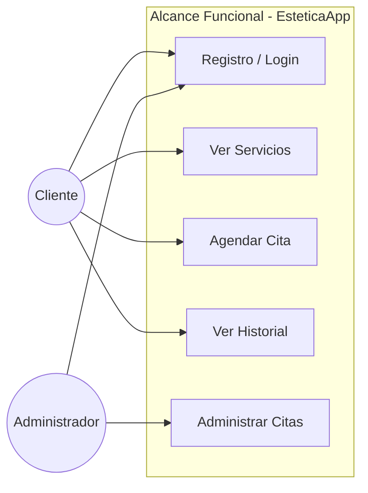
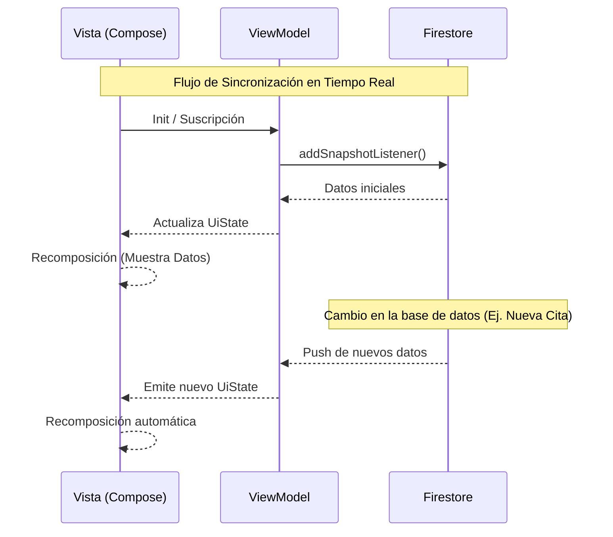

# DOCUMENTACIÓN TÉCNICA - ESTETICAAPP

## 4. PROCESOS

Esta sección detalla la metodología y los procedimientos seguidos durante el ciclo de vida de desarrollo de la aplicación móvil **EsteticaApp**, abarcando desde la concepción inicial hasta la implementación final y puesta en marcha. El enfoque adoptado combina prácticas ágiles con estándares de ingeniería de software para asegurar la calidad y escalabilidad del producto.

### 4.1 Proceso de Análisis y Diseño

El análisis y diseño constituyen la base fundamental del proyecto, asegurando que la solución tecnológica propuesta se alinee con las necesidades del negocio y las expectativas de los usuarios finales.

#### Levantamiento de requerimientos

El proceso de levantamiento de requerimientos se llevó a cabo mediante una serie de sesiones de trabajo iterativas con los stakeholders del proyecto. Se emplearon técnicas de ingeniería de requisitos como entrevistas estructuradas y análisis de casos de uso para identificar tanto los requerimientos funcionales (gestión de citas, autenticación, notificaciones) como los no funcionales (rendimiento, seguridad de datos, usabilidad).

Cada requerimiento identificado fue documentado y validado mediante la creación de historias de usuario y diagramas de flujo. Esta validación temprana permitió detectar ambigüedades y asegurar que el alcance del proyecto estuviera claramente definido antes de iniciar la fase de codificación, minimizando así el riesgo de retrabajos costosos.



#### Diseño de arquitectura del sistema

Para garantizar un código mantenible, escalable y robusto, se diseñó una arquitectura basada en el patrón **MVVM (Model-View-ViewModel)**, alineada con las recomendaciones modernas de Google para el desarrollo en Android. La arquitectura se estructura en capas claramente definidas:

```mermaid
graph TD
    subgraph UI ["Capa de Presentación (UI)"]
        Activity[MainActivity]
        Screen[Pantallas Compose]
    end

    subgraph Logic ["Capa de Lógica (ViewModel)"]
        VM[ViewModel]
        State[UiState (StateFlow)]
    end

    subgraph Data ["Capa de Datos"]
        Repo[Repositorio]
        Model[Data Models]
        Remote[Firebase Source]
    end

    subgraph Cloud ["Nube"]
        Firestore[(Firestore)]
        Auth[(Firebase Auth)]
    end

    Screen -->|Eventos de Usuario| VM
    VM -->|Actualización de Estado| Screen
    VM -->|Solicita Datos| Repo
    Repo -->|Retorna Flow/Datos| VM
    Repo -->|Lee/Escribe| Remote
    Remote <-->|Sincronización| Cloud
```

1.  **Capa de Presentación (UI):** Implementada utilizando **Jetpack Compose** y **Material Design 3**. Esta capa es reactiva y se encarga únicamente de renderizar el estado proporcionado por el ViewModel, sin contener lógica de negocio.
2.  **Capa de Dominio/Lógica (ViewModel):** Los `ViewModels` actúan como intermediarios, gestionando el estado de la UI y comunicándose con la capa de datos. Utilizan **Kotlin Coroutines** y **Flows** para manejar operaciones asíncronas de manera eficiente y segura.
3.  **Capa de Datos:** Responsable de la persistencia y recuperación de información. Se integra directamente con los servicios de **Firebase** (Firestore y Auth), abstrayendo las fuentes de datos para el resto de la aplicación.

#### Diseño de interfaz (UX/UI)

El diseño de la interfaz se centró en ofrecer una experiencia de usuario (UX) intuitiva y fluida, siguiendo los principios de **Material Design 3**. Se priorizó la claridad visual, la consistencia en la navegación y la accesibilidad.

El proceso de diseño incluyó la definición de una paleta de colores coherente y tipografías legibles, así como la creación de componentes reutilizables (botones, tarjetas, campos de entrada) para mantener la uniformidad en todas las pantallas. La navegación se diseñó para ser predictiva, permitiendo al usuario realizar tareas comunes (como agendar una cita) con el mínimo número de toques posible.

### 4.2 Proceso de Desarrollo e Implementación

Esta fase comprende la construcción técnica de la solución, siguiendo estándares de codificación rigurosos y procesos de integración continua.

#### Programación del sistema

El desarrollo del sistema se realizó íntegramente en **Kotlin**, aprovechando sus características modernas como la seguridad de nulos (null-safety) y la programación funcional. Se siguieron principios de "Clean Code" para asegurar que el código fuera legible y fácil de mantener.

La implementación de la interfaz de usuario con **Jetpack Compose** permitió un desarrollo declarativo, reduciendo significativamente la complejidad del código de la UI en comparación con el sistema de Vistas tradicional. Se utilizó la inyección de dependencias y el patrón Observer para mantener el desacoplamiento entre los componentes.

#### Integración de base de datos

La integración con la base de datos se realizó utilizando **Firebase Firestore**, una base de datos NoSQL alojada en la nube y flexible.

*   **Conexión y Sincronización:** La aplicación se conecta a Firestore mediante el SDK oficial de Android. Se implementaron listeners en tiempo real para datos críticos, permitiendo que la interfaz se actualice automáticamente ante cambios en el servidor, ofreciendo una experiencia reactiva al usuario.
*   **Manejo de Datos:** Las operaciones de lectura y escritura se encapsularon en repositorios o servicios dedicados, asegurando que la lógica de acceso a datos esté centralizada. Se utilizaron estructuras de datos (data classes) en Kotlin para mapear los documentos de Firestore a objetos de dominio de manera segura.
*   **Autenticación:** Se integró **Firebase Auth** para gestionar de forma segura el registro y el inicio de sesión de los usuarios, vinculando cada cuenta con sus respectivos datos en Firestore.



#### Pruebas funcionales y de seguridad

Para garantizar la fiabilidad del sistema, se ejecutó un plan de pruebas integral:

*   **Pruebas Funcionales:** Se verificó el correcto funcionamiento de cada característica clave (login, registro, CRUD de datos). Se realizaron pruebas manuales exhaustivas para validar flujos complejos de usuario.
*   **Pruebas de Seguridad:** Se configuraron las reglas de seguridad de Firestore (`Security Rules`) para asegurar que los usuarios solo puedan acceder y modificar los datos para los que tienen permisos explícitos. Además, se validó la implementación de la autenticación para prevenir accesos no autorizados.
*   **Herramientas:** Se utilizaron las herramientas de depuración de Android Studio y la consola de Firebase para monitorear el comportamiento de la aplicación y detectar posibles vulnerabilidades.

#### Pruebas en marcha

Antes del despliegue final, la aplicación fue sometida a pruebas en un entorno real mediante la instalación de APKs en dispositivos físicos de diferentes gamas y tamaños de pantalla.

Esta fase permitió validar el rendimiento de la aplicación en condiciones de red variables (4G/5G/Wi-Fi) y verificar la adaptabilidad de la interfaz (responsividad). También se comprobó el correcto funcionamiento de los servicios en segundo plano, como las notificaciones, y el consumo de batería, asegurando que la aplicación no solo fuera funcional, sino también eficiente y estable para el usuario final.
