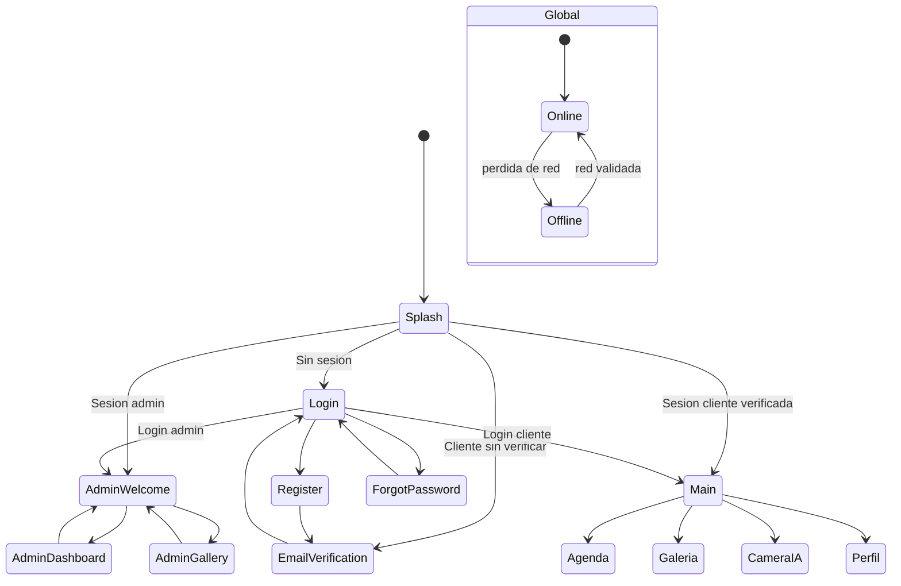

# App States

```mermaid
stateDiagram-v2
    [*] --> Splash

    Splash --> Login: Sin sesion
    Splash --> AdminWelcome: Sesion admin
    Splash --> Main: Sesion cliente verificada
    Splash --> EmailVerification: Cliente sin verificar

    Login --> Register
    Login --> ForgotPassword
    Login --> AdminWelcome: Login admin
    Login --> Main: Login cliente

    Register --> EmailVerification
    EmailVerification --> Login
    ForgotPassword --> Login

    AdminWelcome --> AdminDashboard
    AdminWelcome --> AdminGallery
    AdminDashboard --> AdminWelcome
    AdminGallery --> AdminWelcome

    Main --> Agenda
    Main --> Galeria
    Main --> CameraIA
    Main --> Perfil

    state Global {
      [*] --> Online
      Online --> Offline: perdida de red
      Offline --> Online: red validada
    }
```

## Notas

- Estados globales de conectividad pueden mostrarse sobre cualquier pantalla.
- La ruta inicial depende de sesion, verificacion de correo y rol admin.

