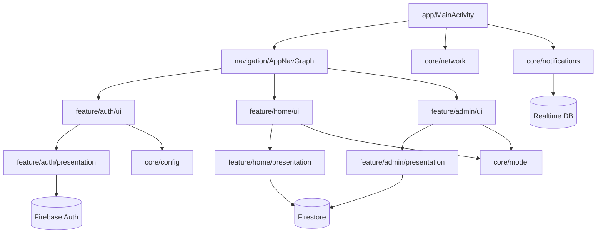

# Architecture Diagram

```mermaid
graph TD
    A[app/MainActivity] --> B[navigation/AppNavGraph]
    B --> C[feature/auth/ui]
    B --> D[feature/home/ui]
    B --> E[feature/admin/ui]

    C --> F[feature/auth/presentation]
    D --> G[feature/home/presentation]
    E --> H[feature/admin/presentation]

    D --> I[core/model]
    E --> I
    C --> J[core/config]
    A --> K[core/network]
    A --> L[core/notifications]

    F --> M[(Firebase Auth)]
    G --> N[(Firestore)]
    H --> N
    L --> O[(Realtime DB)]
```

