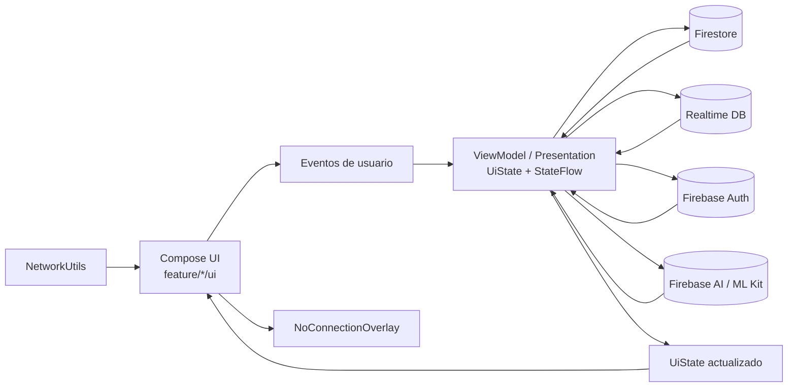

# Data Flow

## Notas

- El flujo es reactivo: cambios de backend actualizan estado y Compose recompone.
- Firestore se usa para datos de negocio; RTDB para notificaciones en tiempo real.
- La conectividad se monitorea globalmente para evitar operaciones inconsistentes offline.

