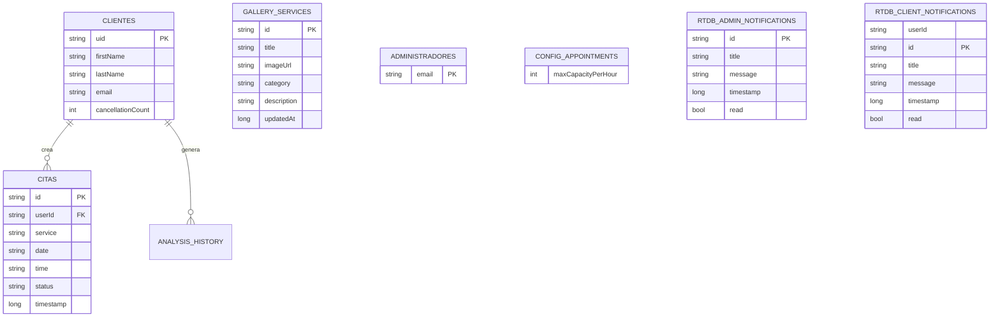

# Database Diagram

```mermaid
erDiagram
    CLIENTES ||--o{ CITAS : "crea"
    CLIENTES ||--o{ ANALYSIS_HISTORY : "genera"

    CLIENTES {
        string uid PK
        string firstName
        string lastName
        string email
        int cancellationCount
    }

    CITAS {
        string id PK
        string userId FK
        string service
        string date
        string time
        string status
        long timestamp
    }

    GALLERY_SERVICES {
        string id PK
        string title
        string imageUrl
        string category
        string description
        long updatedAt
    }

    ADMINISTRADORES {
        string email PK
    }

    CONFIG_APPOINTMENTS {
        int maxCapacityPerHour
    }

    RTDB_ADMIN_NOTIFICATIONS {
        string id PK
        string title
        string message
        long timestamp
        bool read
    }

    RTDB_CLIENT_NOTIFICATIONS {
        string userId
        string id PK
        string title
        string message
        long timestamp
        bool read
    }
```

