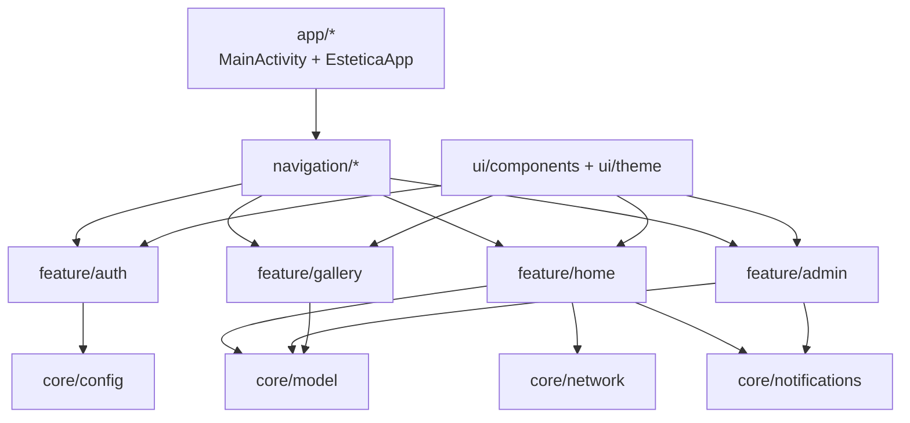

# Module Relations

## Notas

- `navigation` centraliza rutas y flujo entre features.
- `core` expone contratos compartidos; evita acoplar features entre si.
- `ui` contiene componentes transversales y tema visual.

